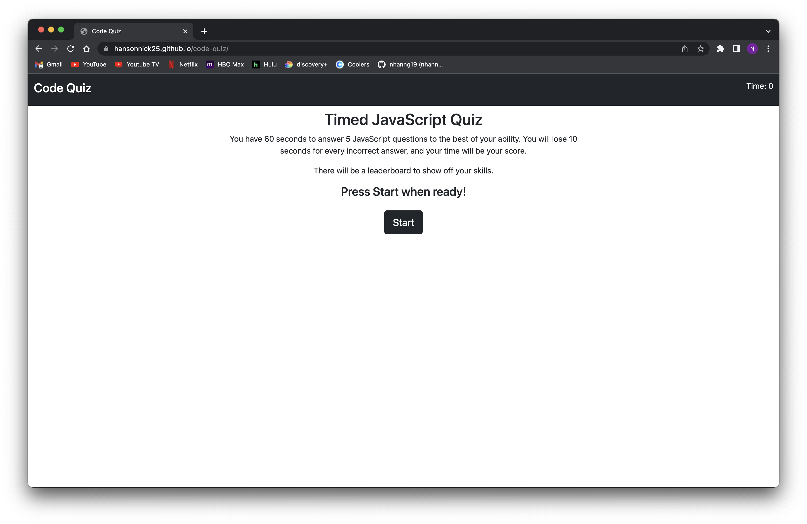
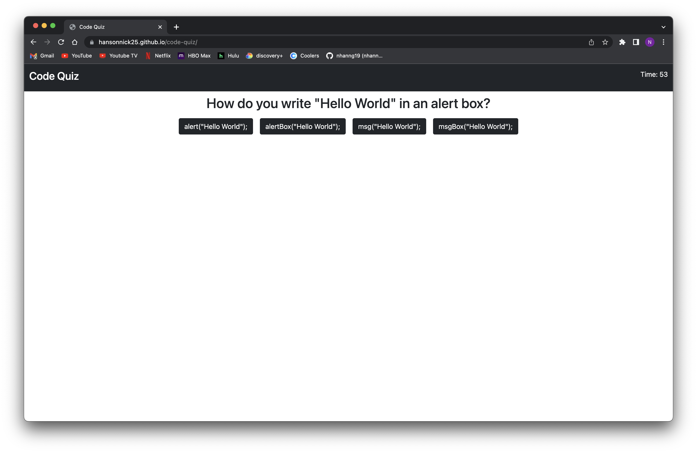
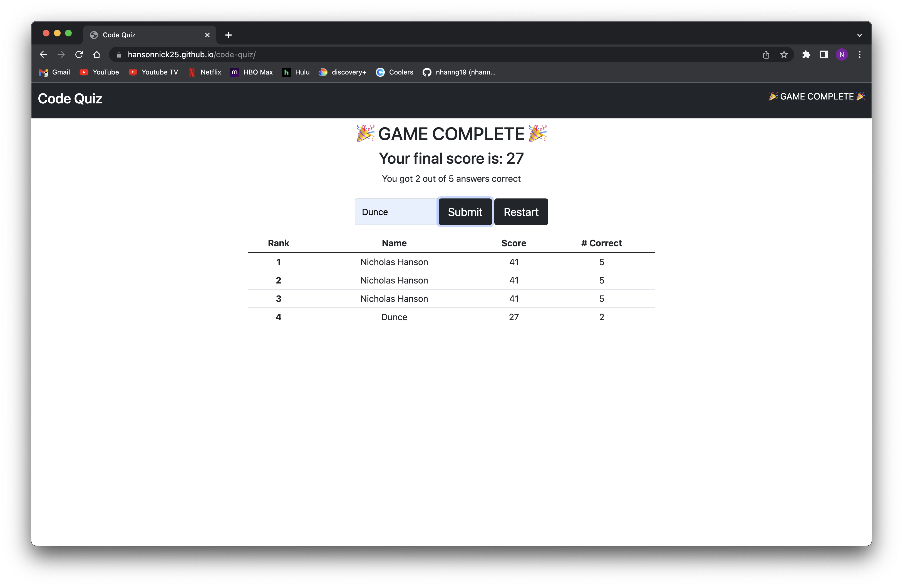

# JavaScript Quiz!

Welcome to my JavaScript quiz! This is a beginner friendly quiz and is only 5 questions long!

## Description

A JavaScript quiz that will test your beginner knowledge of JavaScript fundamentals. The quiz is timed at 60 seconds, and you will lose 10 seconds for every question that you get wrong. There is a leaderboard at the end of the project that will use your localStorage to show your highscores

## Contributing

This is my personal project, I've worked on it alone

## Screenshots

[Link to Deployed Website](https://hansonnick25.github.io/code-quiz/)
